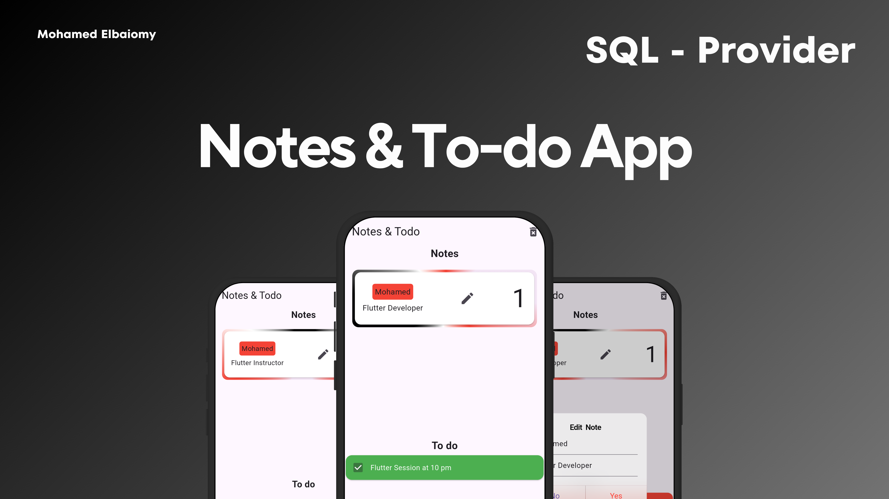

# 🚀 Flutter open source projects!

This repository showcases the projects I've worked on and provides a comprehensive roadmap for learning and development. Whether you're here to explore my work or follow the roadmap, you'll find everything you need to get started.

## What's Inside?
- **Projects**: A collection of projects I've completed, ranging from beginner to advanced levels.
- **Roadmap**: A detailed guide to help you navigate through essential topics and resources for mastering development.

 

  
   
  <h2>Mohamed Elbaiomy</h2>

### About Me
Hello! I'm **Mohamed Elbaiomy**, a Software developer with a strong focus on mobile development, specializing in Flutter. With over four years of programming experience and two years specifically in mobile applications.

Beyond coding, I actively participate in various volunteering activities, enhancing my skills in communication, leadership, planning, and teamwork. I also have delivered talks at technology events, including sessions for GDG Benha & GDG Al-Azhar.

I am dedicated to continuous learning and hard work in my field.

## Gallery

<table>
    <tr>
        <td>
            
        </td>
        <td>
            
        </td>
    </tr>
    <tr>
        <td>
            
        </td>
        <td>
            
        </td>
    </tr>
    <tr>
        <td>
            
        </td>
        <td>
            
        </td>
    </tr>
     <tr>
        <td>
            
        </td>
        <td>
            
        </td>
    </tr>
    <tr>
        <td>
            
        </td>
        <td>
            
        </td>
    </tr>
    <tr>
        <td>
            
        </td>
        <td>
            
        </td>
    </tr>
    <tr>
        <td>
            
        </td>
        <td>
            
        </td>
    </tr>
    <tr>
        <td colspan="2">
            
        </td>
    </tr>
</table>

# Flutter Learning Roadmap 🚀

Welcome to the Flutter Learning Roadmap! This guide provides a structured path to mastering Flutter development, complete with free resources and tips to access paid courses for free.

---

## 📚 Roadmap

| **Topic**                  | **Youtube**                                                                 | **Udemy**                                                                 | **How to Get the Course for Free (Note)**                                                                 |
|----------------------------|-----------------------------------------------------------------------------|------------------------------------------------------------------------------|----------------------------------------------------------------------------------------------------------|
| **Dart -- ( Basics - OOP - Async Programming - Future - Stream )** | [Wael Abo Hamza](https://www.youtube.com/playlist?list=PL93xoMrxRJIutlMCImcV3CYMmjS0MmlWL) | [Tharwat Samy](https://www.udemy.com/course/mastering-programming-a-comprehensive-course-in-arabic/) | م.ثروت سامى بينزل كوبونات مجانية على كل الكورسات الخاصه بيه على البيدج عنده كل يوم 5 من كل شهر الساعة 5 فـ اتأكد انك عندك اكونت على يوديمي عشان تقدر تاخد الكورس فى الوقت ده بالظبط   [Facebook](https://www.facebook.com/tharwat.samy.9) |
| **Solid Principles**| [Omar Ahmed](https://www.youtube.com/playlist?list=PLwWuxCLlF_uevri_OpofVLXkRRFnZ7TSV) | | |
| **Flutter -- ( Basic - Scrollable - Interactive ) Widgets** | [Wael Abo Hamza](https://www.youtube.com/playlist?list=PL93xoMrxRJIvtIXjAiX15wcyNv-LOWZa9) | [Tharwat Samy](https://www.udemy.com/course/best-and-complete-flutter-course-for-beginners/) | م.ثروت سامى بينزل كوبونات مجانية على كل الكورسات الخاصه بيه على البيدج عنده كل يوم 5 من كل شهر الساعة 5 فـ اتأكد انك عندك اكونت على يوديمي عشان تقدر تاخد الكورس فى الوقت ده بالظبط   [Facebook](https://www.facebook.com/tharwat.samy.9) |
| **Flutter common Plugins or Packages** | [Wael Abo Hamza](https://www.youtube.com/playlist?list=PL93xoMrxRJIuIpCMr4qi2XkOzdEX7PlrU)     [Flutter Official Channel](https://www.youtube.com/playlist?list=PLjxrf2q8roU1quF6ny8oFHJ2gBdrYN_AK)   |||
| **Animation** | [Basel Moustafa](https://www.youtube.com/playlist?list=PL9b6wgodx-C2_nzF7GF7vnJZvjOkPgu_X)     [Wael Abo Hamza](https://www.youtube.com/playlist?list=PL93xoMrxRJIswyhTYGTD3ADy5mJKSkpnh)  | [Mina Farid](https://www.udemy.com/course/flutter-animations-from-zero-to-hero/) | م.مينا بينزل كوبونات مجانية كل فتره على البيدج الخاصه بيه   [Facebook](https://www.facebook.com/mina.f.elijah) |
| **State Management** | [Wael Abo Hamza (Provider)](https://www.youtube.com/playlist?list=PL93xoMrxRJIviJiC76oO5aV8bDp2s3OrA)     [Wael Abo Hamza (Bloc)](https://www.youtube.com/playlist?list=PL93xoMrxRJIv4wze2WyaotWpLX7Wk9u7R)     [Omar Ahmed (Bloc)](https://www.youtube.com/playlist?list=PLwWuxCLlF_ufA0GYYjlx_R4smekKH_AuB) | [Tharwat Samy](https://www.udemy.com/course/flutter-bloc-pattern-from-zero-to-hero-in-arabic/) | م.ثروت سامى بينزل كوبونات مجانية على كل الكورسات الخاصه بيه على البيدج عنده كل يوم 5 من كل شهر الساعة 5 فـ اتأكد انك عندك اكونت على يوديمي عشان تقدر تاخد الكورس فى الوقت ده بالظبط   [Facebook](https://www.facebook.com/tharwat.samy.9) |
| **Local Database** | [Wael Abo Hamza (Sqflite)](https://www.youtube.com/playlist?list=PL93xoMrxRJIvPg3nW8WG0HDDgpMQtUkag)     [Wael Abo Hamza (Shared Preferences)](https://www.youtube.com/watch?v=6xH2pXPbYbs)        [Tharwat Samy (Hive)](https://www.youtube.com/playlist?list=PLGVaNq6mHings18_i0ZURis6LQ-zYMD4x)     [Basel Moustafa (Hive)](https://www.youtube.com/playlist?list=PL9b6wgodx-C3VRvma06Lz6Y7-fr5fMy6K) | | |
| **API** | [Happy Tech](https://youtube.com/playlist?list=PLW3uJGWFOnbEw2PfOLoBV8msehVZtIWFz&si=6rwiFUtI8XxoAIZ7)       [Omar Ahmed](https://www.youtube.com/playlist?list=PLwWuxCLlF_ud0orMMKU893fm1OvF4xSRk) | | |
| **Firebase** | [Wael Abo Hamza](https://www.youtube.com/playlist?list=PL93xoMrxRJIvHhxhB21YzzeimEEzzAz6g) | | |
| **Payment** | [Basel Moustafa (Paymob)](https://www.youtube.com/watch?v=UYR8IFCWCH4&t=209s)     [TechTrack (Fawaterak)](https://www.youtube.com/watch?v=RMwG0vRS6nA) | [Tharwat Samy](https://www.udemy.com/course/flutter-payment-integration-stripe-paypal-more-arabic/) | م.ثروت سامى بينزل كوبونات مجانية على كل الكورسات الخاصه بيه على البيدج عنده كل يوم 5 من كل شهر الساعة 5 فـ اتأكد انك عندك اكونت على يوديمي عشان تقدر تاخد الكورس  فى الوقت ده بالظبط   [Facebook](https://www.facebook.com/tharwat.samy.9) |
| **Resposive & Adaptive**| [Omar Ahmed](https://www.youtube.com/playlist?list=PLwWuxCLlF_ue_b0RZ_t6qjf_Nupkdq9BE) | [Tharwat Samy](https://www.udemy.com/course/mastering-flutter-responsive-adaptive-ui-design-arabic/) | م.ثروت سامى بينزل كوبونات مجانية على كل الكورسات الخاصه بيه على البيدج عنده كل يوم 5 من كل شهر الساعة 5 فـ اتأكد انك عندك اكونت على يوديمي عشان تقدر تاخد الكورس فى الوقت ده بالظبط   [Facebook](https://www.facebook.com/tharwat.samy.9) |
| **Localization** | [Tharwat Samy](https://www.youtube.com/watch?v=DMmvd5LAHuA&t=793s) | | |
| **GitHub** | [Tarek Alabd](https://www.youtube.com/watch?v=5i_FzxdqWc8)      [Ghareed Elshaikh](https://www.youtube.com/watch?v=fDkR0TDR9dI&t=2179s) | [Tharwat Samy](https://www.udemy.com/course/master-git-github-essential-skills-for-developersarabic/) | م.ثروت سامى بينزل كوبونات مجانية على كل الكورسات الخاصه بيه على البيدج عنده كل يوم 5 من كل شهر الساعة 5 فـ اتأكد انك عندك اكونت على يوديمي عشان تقدر تاخد الكورس فى الوقت ده بالظبط   [Facebook](https://www.facebook.com/tharwat.samy.9) |
| **Change Theme** | [Zaitoon Tech](https://www.youtube.com/watch?v=c7mlpSW0HYI) | | |
| **Design Patterns** | [Omar Ahmed](https://www.youtube.com/playlist?list=PLwWuxCLlF_uczNpsoKEEi7zHcuL07Otos) | | |
| **Clean Architecture** | [Happy Tech](https://www.youtube.com/watch?v=o1e5LKnh4aw)      [Rabee Omran](https://www.youtube.com/playlist?list=PLwJ4sQ79Ehm69Bmed-XrRCc-_H1R3nWhd) | [Tharwat Samy](https://www.udemy.com/course/deep-dive-into-clean-architecture-in-flutter-2022arabic/)     [Usama Elgendy](https://www.udemy.com/course/flutter-clean-architecture-2022-flutter-3-in-arabic/) | م.ثروت سامى بينزل كوبونات مجانية على كل الكورسات الخاصه بيه على البيدج عنده كل يوم 5 من كل شهر الساعة 5 فـ اتأكد انك عندك اكونت على يوديمي عشان تقدر تاخد الكورس فى الوقت ده بالظبط   [Facebook](https://www.facebook.com/tharwat.samy.9)     م.اسامه بينزل كوبونات مجانية كل فتره على البيدج الخاصه بيه [Facebook](https://www.facebook.com/usamaaelgendy)  |
| **Flutter Local Notifications** | [Ammar Ageeza](https://youtube.com/playlist?list=PLYfTCw9blWRO2Bx37MNT0zc1WMlLwaICe&si=munBfg5d3p6XXJBb) | | |
| **Creational design pattern** | [Mohamed Reda](https://www.youtube.com/playlist?list=PLnqAlQ9hFYdewk9UKGBcHLulZNUBpNSKJ) | | |
| **Behavioral design** | [Mohamed Reda](https://youtube.com/playlist?list=PLnqAlQ9hFYdex66Z6ViaYFQqvFD1C_G7j&si=LpKG-qUAH7ULutCI) | | |
| **Structure design pattern** | [Mohamed Reda](https://youtube.com/playlist?list=PLnqAlQ9hFYdcW3viz_oXRal_FNkg2Dssm&si=Xhd8ez0GyNBoYB1H) | | |

---

## 🚀 How to Use This Roadmap

1. **Start with Basics**: Begin with the **Basics** topic and follow the provided resources.
2. **Explore Advanced Topics**: Move on to **OOP**, **Async Programming**, and **State Management** and more as you progress.
3. **Leverage Free Resources**: Use the written notes so that you can take the course during the free time available.
4. **Practice**: Build small projects to solidify your understanding of each topic.

---

## 🤝 Contributing

If you have additional resources, tips, or improvements, feel free to tell me.

Happy Learning! 🌟
